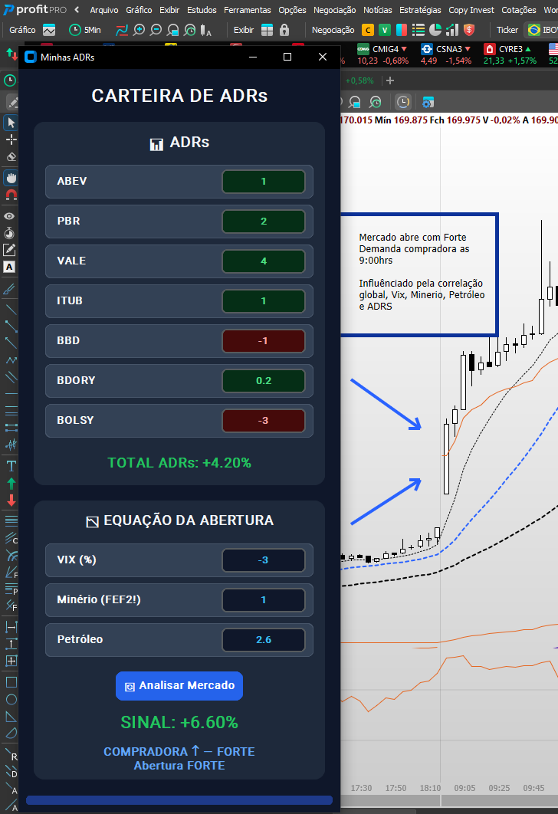
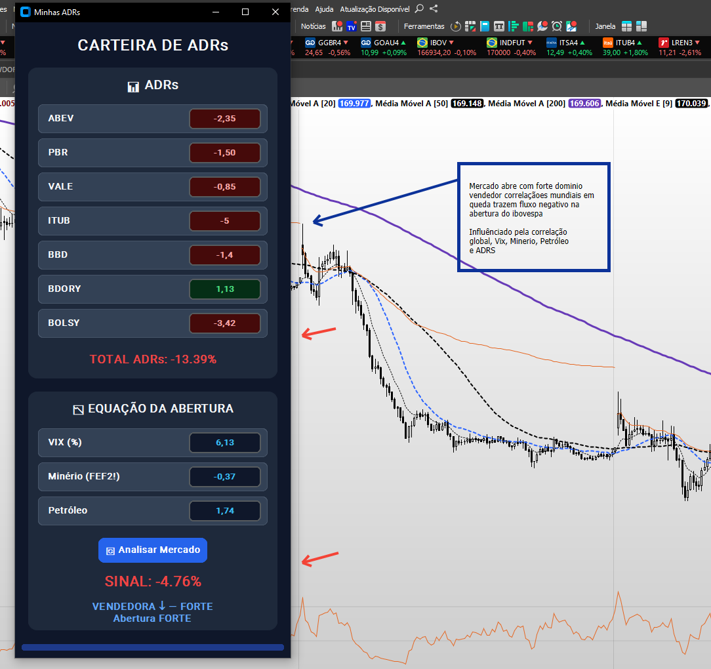
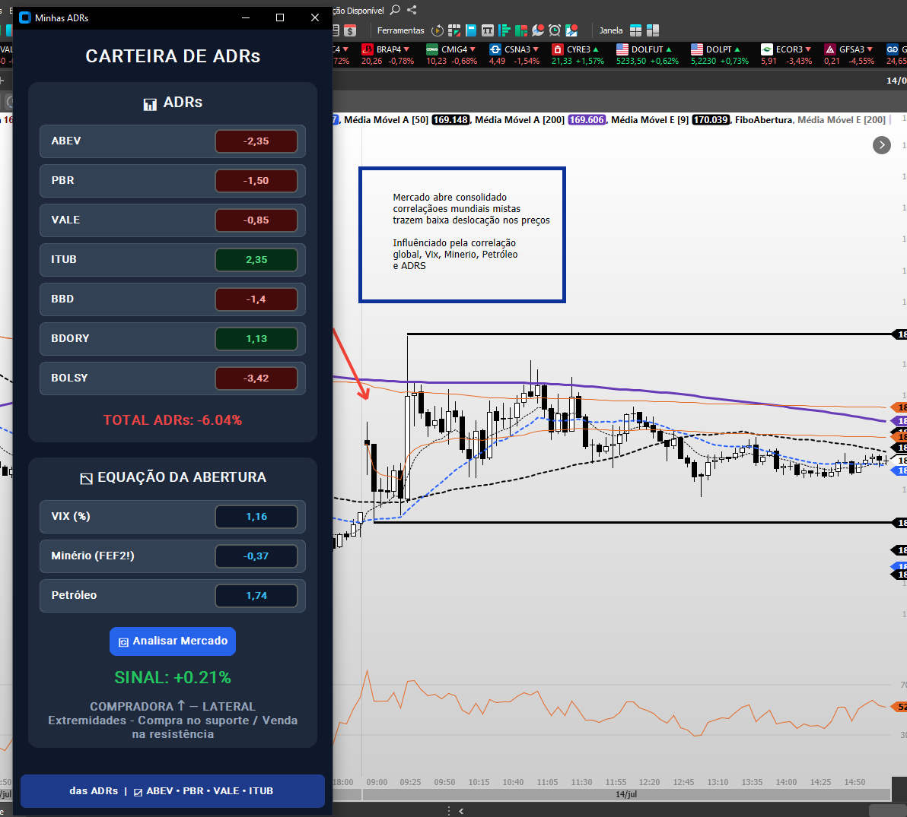

# 📈 Projeto ADRS - Análise de Abertura B3

> **Análise quantitativa de abertura para o Mini Índice (B3) utilizando o saldo de ADRs, VIX e cotações de Commodities.**

Esta ferramenta analisa os principais drivers do mercado global antes da abertura da bolsa brasileira (B3) para projetar o **viés e a probabilidade de gap de abertura** do Mini Índice (`WIN`).

---

## 📸 Casos de Uso & Exemplos Práticos

Abaixo estão três exemplos de leitura do mercado comparando o sinal quantitativo calculado pelo sistema com a movimentação real no **ProfitChart**:

### 1. Gap de Alta (Pressão Compradora)
Quando os ADRs brasileiros em NY sobem acompanhados da alta das commodities e risco controlado (VIX em queda), o indicador aponta um forte viés comprador para a abertura.



> **Cenário:** O sistema identificou saldo comprador elevado nos ADRs pré-mercado.  
> **Resultado no ProfitChart:** O Mini Índice abriu com um gap de alta acentuado, confirmando a projeção quantitativa.

---

### 2. Mercado abre em Queda (Pressão Vendedora)
Em dias de aversão ao risco global ou queda acentuada de commodities importantes (como Vale e Petrobras em NY), a ferramenta aponta pressão vendedora.



> **Cenário:** Sinalizador calculou viés vendedor devido à queda forte das ADRs e alta do VIX.  
> **Resultado no ProfitChart:** O mercado abriu com forte movimento de queda já na primeira vela(candle) do dia.

---

### 3. Consolidação / Sem Gap significativo (Mercado Neutro)
Quando as forças de ADRs e commodities se anulam ou a oscilação global é neutra, a projeção sinaliza cautela.



> **Cenário:** Indicador neutro/equilibrado.  
> **Resultado no ProfitChart:** Abertura próxima ao fechamento anterior, reduzindo a expectativa de operar a variação do gap.

---

## 🚀 Como Executar o Projeto

1. **Clone o repositório:**
   ```bash
   git clone [https://github.com/SEU_USUARIO/Projeto_ADRS_AberturaB3.git](https://github.com/SEU_USUARIO/Projeto_ADRS_AberturaB3.git)
   cd Projeto_ADRS_AberturaB3